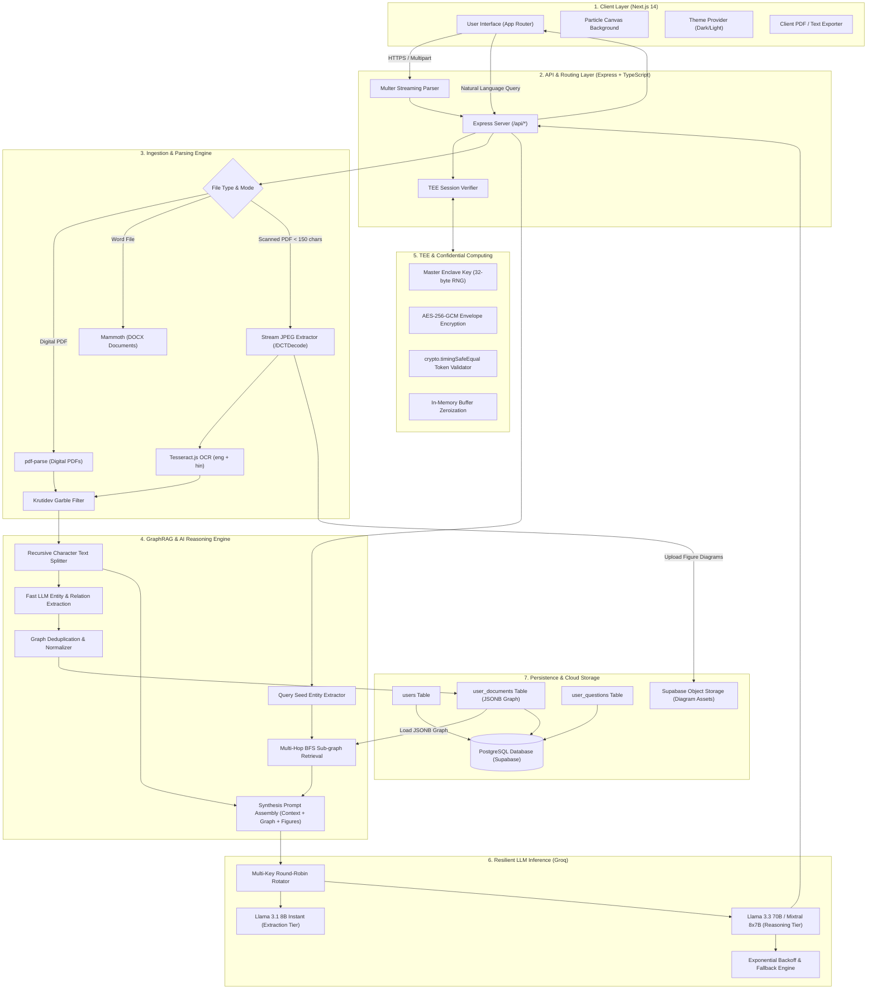
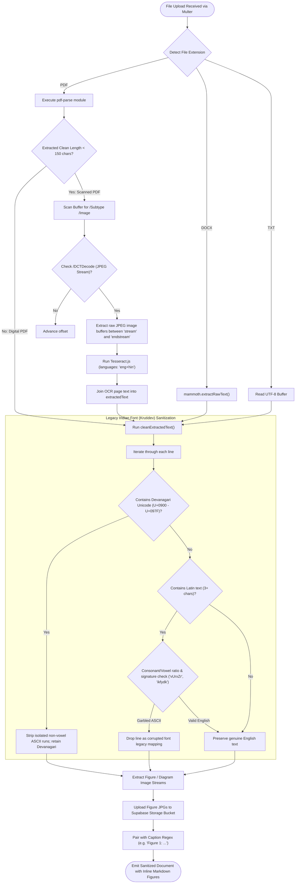
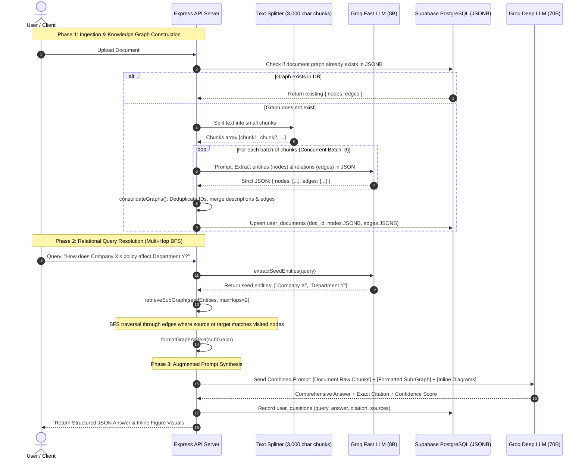
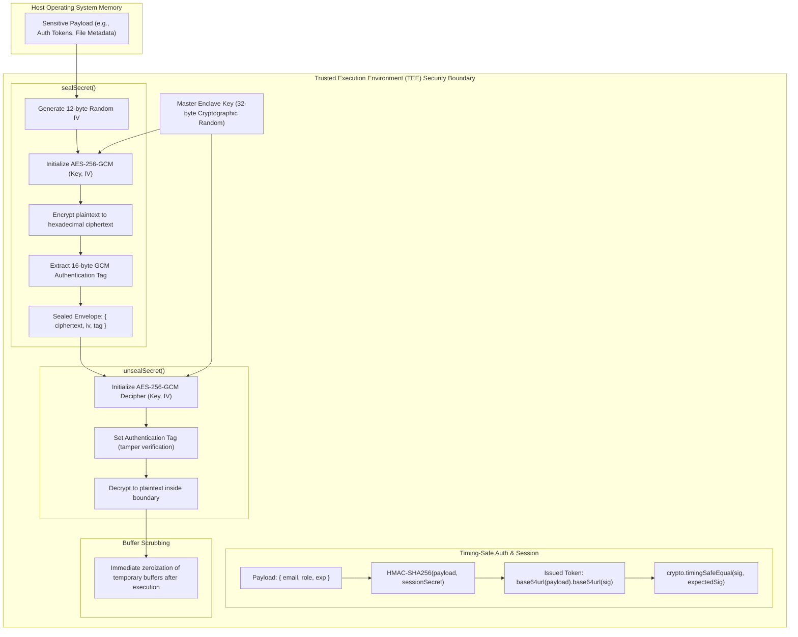
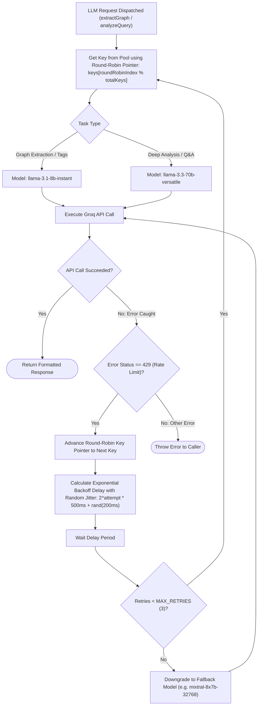
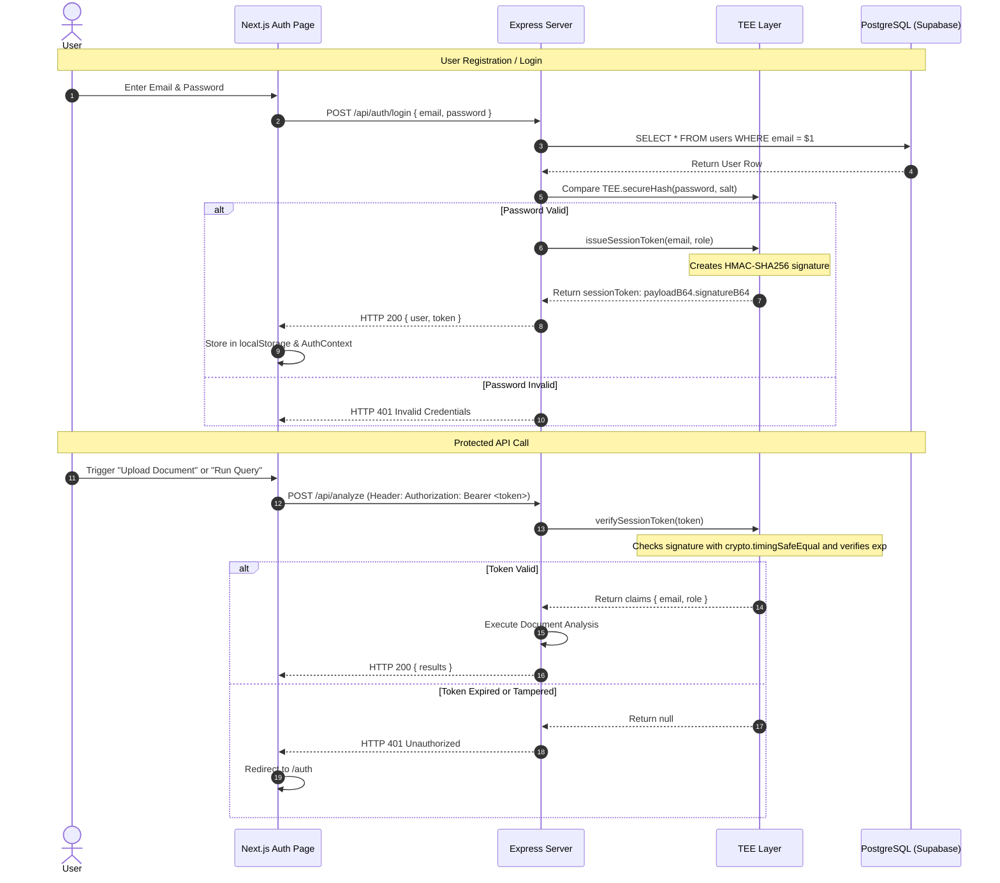
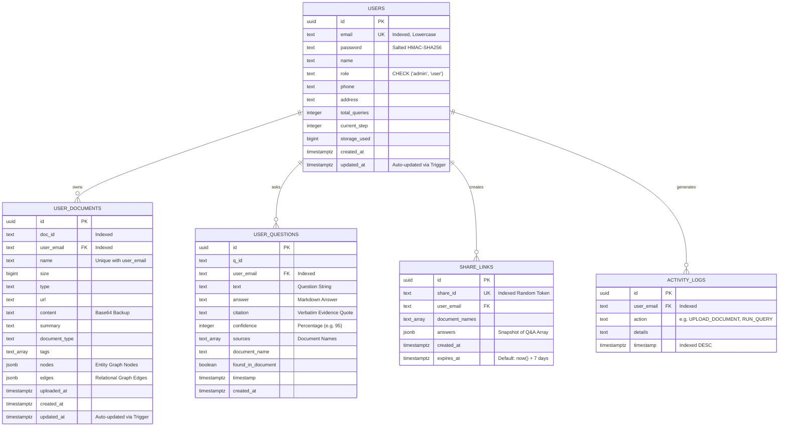

# 🧠 DocuMind AI — Complete Technical Master Handbook & Interview Guide

> **Single-File Reference**: This master document contains the complete, end-to-end technical documentation for **DocuMind AI**. It integrates system architectures, Mermaid flowcharts, component deep-dives, file-by-file code maps, PostgreSQL schemas, resume bullet points, behavioral STAR stories, and 25 technical interview questions with model answers.

---

## 📑 Table of Contents
1. [Executive Summary & High-Level Specifications](#1-executive-summary--high-level-specifications)
2. [System Architecture & Visual Flowcharts](#2-system-architecture--visual-flowcharts)
   - 2.1 [End-to-End System Architecture](#21-end-to-end-system-architecture)
   - 2.2 [Document Ingestion & Dual OCR Pipeline Flowchart](#22-document-ingestion--dual-ocr-pipeline-flowchart)
   - 2.3 [GraphRAG Knowledge Graph Pipeline Flowchart](#23-graphrag-knowledge-graph-pipeline-flowchart)
   - 2.4 [Confidential Computing / TEE Simulation Flowchart](#24-confidential-computing--tee-simulation-flowchart)
   - 2.5 [Multi-Key LLM Routing & Exponential Backoff Flowchart](#25-multi-key-llm-routing--exponential-backoff-flowchart)
   - 2.6 [Authentication & Session Lifecycle Flowchart](#26-authentication--session-lifecycle-flowchart)
3. [Technology Deep-Dive & Engineering Rationale](#3-technology-deep-dive--engineering-rationale)
   - 3.1 [Document Ingestion, OCR & Font Sanitization](#31-document-ingestion-ocr--font-sanitization)
   - 3.2 [GraphRAG Engine & Multi-Hop Traversal](#32-graphrag-engine--multi-hop-traversal)
   - 3.3 [Confidential Computing & TEE Simulation](#33-confidential-computing--tee-simulation)
   - 3.4 [High-Throughput LLM Routing & Resilience](#34-high-throughput-llm-routing--resilience)
   - 3.5 [Persistence: PostgreSQL (Supabase) vs. Dedicated Graph DB](#35-persistence-postgresql-supabase-vs-dedicated-graph-db)
   - 3.6 [Frontend Architecture & Visual Features](#36-frontend-architecture--visual-features)
4. [Complete Codebase Directory & File Map](#4-complete-codebase-directory--file-map)
   - 4.1 [Repository Directory Tree](#41-repository-directory-tree)
   - 4.2 [Backend File Breakdown](#42-backend-file-breakdown)
   - 4.3 [Frontend File Breakdown](#43-frontend-file-breakdown)
   - 4.4 [Complete REST API Endpoints Catalog](#44-complete-rest-api-endpoints-catalog)
5. [Database Schema & Relational Data Models](#5-database-schema--relational-data-models)
   - 5.1 [Entity-Relationship (ER) Diagram](#51-entity-relationship-er-diagram)
   - 5.2 [Table DDL, Constraints & Indexes](#52-table-ddl-constraints--indexes)
   - 5.3 [Database Automation Triggers](#53-database-automation-triggers)
   - 5.4 [JSONB Knowledge Graph Payloads](#54-jsonb-knowledge-graph-payloads)
6. [Resume & Interview Preparation Handbook](#6-resume--interview-preparation-handbook)
   - 6.1 [Resume Bullet Points by Specialization](#61-resume-bullet-points-by-specialization)
   - 6.2 [Behavioral STAR Interview Stories](#62-behavioral-star-interview-stories)
   - 6.3 [Top 25 Technical Interview Questions & Model Answers](#63-top-25-technical-interview-questions--model-answers)

---

## 1. Executive Summary & High-Level Specifications

**DocuMind AI** is an enterprise-grade document intelligence platform designed to parse dense, multi-modal documents (PDF, DOCX, TXT, scanned images) and provide grounded, multi-hop question answering with zero-hallucination guardrails and confidential computing guarantees.

### Key Specifications
- **Core AI Paradigms**: Graph-Augmented Retrieval (GraphRAG), Dual-Mode OCR (Tesseract.js `eng+hin`), Multi-Key Tiered Inference.
- **Frontend**: Next.js 14 (App Router), React 18, TypeScript, Tailwind CSS, Radix UI Primitives, HTML5 Canvas.
- **Backend API**: Node.js, Express.js, TypeScript, LangChain (`@langchain/core`, `@langchain/groq`), Multer.
- **Inference Hardware**: Groq Cloud Processing Units (LPUs) serving `llama-3.3-70b-versatile`, `llama-3.1-8b-instant`, and `mixtral-8x7b-32768`.
- **Database & Storage**: PostgreSQL on Supabase (`pg.Pool` connection pooling), JSONB graph storage, and Supabase Object Storage for extracted diagrams.
- **Security & Enclave**: AES-256-GCM envelope encryption, timing-safe HMAC-SHA256 authentication (`crypto.timingSafeEqual`), and in-memory buffer sanitization.

---

## 2. System Architecture & Visual Flowcharts

### 2.1 End-to-End System Architecture



---

### 2.2 Document Ingestion & Dual OCR Pipeline Flowchart



---

### 2.3 GraphRAG Knowledge Graph Pipeline Flowchart



---

### 2.4 Confidential Computing / TEE Simulation Flowchart



---

### 2.5 Multi-Key LLM Routing & Exponential Backoff Flowchart



---

### 2.6 Authentication & Session Lifecycle Flowchart



---

## 3. Technology Deep-Dive & Engineering Rationale

### 3.1 Document Ingestion, OCR & Font Sanitization
1. **`pdf-parse`**: Employs Mozilla `pdf.js` text layer extraction. Executes directly in Node.js with zero external C++ runtime dependencies.
2. **`mammoth`**: Converts `.docx` XML DOM structures (`<w:p>`, `<w:t>`) to plain semantic text without layout HTML overhead.
3. **Zero-Transcode JPEG Stream Slicing**:
   - Rather than rendering entire PDF pages to high-resolution PNGs with Ghostscript (costing 15+ seconds per page), DocuMind parses the raw buffer for `/Subtype /Image` and `/DCTDecode`.
   - Extracts raw JPEG streams directly from byte offsets between `stream` and `endstream`, completing in milliseconds.
4. **Tesseract.js (`eng+hin`)**:
   - WebAssembly-based OCR engine.
   - Bundles local pre-trained neural networks (`eng.traineddata` and `hin.traineddata`) inside `backend/` to prevent external network downloads during container cold boots.
5. **Krutidev Garble Detection Algorithm (`cleanExtractedText`)**:
   - Legacy Indian fonts store Devanagari glyphs as 8-bit ASCII characters.
   - The algorithm computes the vowel-to-consonant ratio and matches signature Krutidev prefixes (`vUrxZr`, `ikfydk`, `lkFk`), purging corrupted lines while preserving authentic Unicode Devanagari (`\u0900-\u097F`).

---

### 3.2 GraphRAG Engine & Multi-Hop Traversal

#### Why Vector RAG Fails on Relational Queries
Vector search relies on cosine similarity of text embeddings. If an answer requires connecting facts distributed across non-adjacent pages (e.g., an author on Page 2 and an authorized policy on Page 85), vector search fails because neither chunk independently resembles the query.

#### How DocuMind Solves This
1. **Structured Entity & Relation Extraction**:
   - Splits text into 3,000-character chunks.
   - Fast LLM (`llama-3.1-8b-instant`) extracts entities (`nodes`) and relations (`edges`) into strict JSON.
2. **Consolidation (`consolidateGraphs`)**:
   - Normalizes IDs and merges duplicate nodes and multi-source edges into an interconnected document graph.
3. **Seed Entity Extraction**:
   - When a question arrives, named entities are extracted (`extractSeedEntities`).
4. **Multi-Hop Breadth-First Search (BFS)**:
   - Traverses adjacent edges up to `maxHops = 2`, retrieving the connected relational sub-graph.
5. **Prompt Injection (`formatGraphAsText`)**:
   - Serializes the sub-graph into natural language and appends it to the prompt context.

---

### 3.3 Confidential Computing & TEE Simulation
1. **AES-256-GCM Envelope Encryption**:
   - 256-bit symmetric cipher in Galois/Counter Mode.
   - Provides both confidentiality and cryptographic integrity verification via 128-bit authentication tags.
2. **Constant-Time Signature Validation**:
   - Mitigates timing side-channel attacks by comparing authentication signatures using `crypto.timingSafeEqual(sigBuf, expectedBuf)` instead of short-circuiting string comparisons.
3. **Memory Hygiene**:
   - Volatile buffers and decrypted strings are cleared and garbage-collected immediately after execution to prevent memory-dump extraction.

---

### 3.4 High-Throughput LLM Routing & Resilience
1. **Decoupled Tiered Models**:
   - High-volume extraction $\to$ `llama-3.1-8b-instant` (~800 tokens/sec).
   - Deep reasoning & synthesis $\to$ `llama-3.3-70b-versatile` (~250 tokens/sec).
2. **Multi-Key Round-Robin Pool**:
   - Ingests multiple API keys from environment variables and rotates requests sequentially.
3. **Exponential Backoff with Jitter**:
   $$\text{Delay} = (2^{\text{attempt}} \times 500\,\text{ms}) + \text{UniformRandom}(0, 200\,\text{ms})$$
   Mitigates the "thundering herd" problem when retrying after HTTP 429 rate-limit responses.

---

### 3.5 Persistence: PostgreSQL (Supabase) vs. Dedicated Graph DB

| Dimension | PostgreSQL + JSONB (DocuMind) | Dedicated Graph DB (Neo4j) |
|---|---|---|
| **Operational Overhead** | Single unified relational engine for users, files, and graphs. | Requires maintaining two separate database clusters. |
| **Transaction ACID** | Atomic consistency across documents and knowledge graphs. | Requires distributed two-phase commits. |
| **Graph Scope** | Optimized for document-level subgraphs (100–5,000 nodes). | Optimized for global multi-billion-node enterprise graphs. |
| **Traversal Speed** | In-memory BFS over parsed JSONB executes in < 2ms. | Cypher network round-trip overhead exceeds JSONB traversal. |

---

### 3.6 Frontend Architecture & Visual Features
1. **Next.js 14 App Router**: Hybrid client-server architecture with strict route layouts.
2. **Interactive Canvas Particles (`particles-background.tsx`)**: Renders an animated particle network simulating knowledge graph topology based on Euclidean distance calculations:
   $$\alpha = 1 - \frac{d}{\text{threshold}}$$
3. **Client-Side PDF Generation (`export-pdf.ts`)**: Generates printable dossiers using `jsPDF` and `html2canvas` directly in the browser, eliminating server rendering load.

---

## 4. Complete Codebase Directory & File Map

### 4.1 Repository Directory Tree

```
DocuMind-main/
├── backend/                               # Express.js REST API & Ingestion Server
│   ├── db/
│   │   └── schema.sql                     # Supabase/PostgreSQL idempotent schema DDL
│   ├── lib/
│   │   ├── db.ts                          # Database data-access layer (PostgreSQL CRUD)
│   │   ├── graphrag.ts                    # Knowledge graph extraction, consolidation & BFS
│   │   ├── pg.ts                          # PostgreSQL connection pool manager
│   │   ├── storage.ts                     # Supabase object storage (diagram asset uploads)
│   │   └── tee.ts                         # Trusted Execution Environment (AES-256-GCM, Auth)
│   ├── eng.traineddata                    # Tesseract English OCR neural model
│   ├── hin.traineddata                    # Tesseract Hindi/Devanagari OCR neural model
│   ├── server.ts                          # Main Express application, API routes & pipeline
│   ├── package.json                       # Backend dependencies & build scripts
│   └── tsconfig.json                      # Strict TypeScript compiler options
├── frontend/                              # Next.js 14 Web Application
│   ├── app/                               # Next.js 14 App Router pages
│   │   ├── admin/page.tsx                 # System metrics, user management & activity logs
│   │   ├── auth/page.tsx                  # User authentication (Login / Signup / OTP)
│   │   ├── contact/page.tsx               # Contact support and email feedback form
│   │   ├── documents/page.tsx             # Document vault, delete/download & metadata view
│   │   ├── history/page.tsx               # Question-and-answer historical log
│   │   ├── profile/page.tsx               # User account profile & query quota usage
│   │   ├── query/page.tsx                 # Question input, templates & language/mode selection
│   │   ├── results/page.tsx               # Analytical answers, citations, figures & PDF export
│   │   ├── share/[shareId]/page.tsx       # Public shared analytical report view
│   │   ├── upload/page.tsx                # Drag-and-drop file upload, tags & summary preview
│   │   ├── globals.css                    # Tailwind CSS theme variables & styling
│   │   ├── layout.tsx                     # Root HTML layout with Navbar & Footer
│   │   └── page.tsx                       # Landing page with hero, features & demo preview
│   ├── components/                        # Reusable React components
│   │   ├── ui/                            # Radix UI primitives styled with Tailwind (40+ items)
│   │   ├── auth-provider.tsx              # React Context for session management & persistent state
│   │   ├── follow-up-chat.tsx             # Interactive floating follow-up Q&A chat drawer
│   │   ├── footer.tsx                     # Global footer with links and system status
│   │   ├── hero-background.tsx            # Decorative visual background for landing hero
│   │   ├── navbar.tsx                     # Global navigation bar with auth status & navigation
│   │   ├── particles-background.tsx       # Canvas-based dynamic knowledge graph particles
│   │   ├── progress-stepper.tsx           # Multi-step workflow visual progress indicator
│   │   ├── theme-provider.tsx             # Dark/Light theme switching provider
│   │   └── theme-toggle.tsx               # Dark/Light mode toggle button
│   ├── hooks/                             # Custom React hooks (use-mobile, use-toast)
│   ├── lib/                               # Client utility libraries (export-pdf, export-text)
│   ├── package.json                       # Frontend dependencies & Next.js scripts
│   ├── tailwind.config.ts                 # Tailwind design tokens, typography & animations
│   └── tsconfig.json                      # Frontend TypeScript configuration
├── .env.local.example                     # Environment variable template
├── .gitignore                             # Git ignore file (ignoring secrets, builds & modules)
├── PROJECT_DOCUMENTATION.md               # This master documentation file
├── render.yaml                            # Cloud deployment configuration for Render
└── README.md                              # Repository overview & quickstart guide
```

---

### 4.2 Backend File Breakdown
- **`backend/server.ts`**: Express application setup, Multer middleware, multi-key Groq pool rotation, `/api/analyze` pipeline, and auxiliary AI routes (`/api/summarize`, `/api/suggest-questions`, `/api/followup-stream`).
- **`backend/lib/graphrag.ts`**: Entity/relation extraction prompts, graph deduplication/merging, seed entity identification, and BFS traversal.
- **`backend/lib/tee.ts`**: AES-256-GCM encryption/decryption, timing-safe session tokens, and cryptographic OTP generation.
- **`backend/lib/db.ts`**: Data Access Layer containing parameterized SQL queries for all entities.
- **`backend/lib/pg.ts`**: Single `pg.Pool` connection pool instance configured with SSL for Supabase.
- **`backend/lib/storage.ts`**: Supabase Storage integration for uploading extracted diagram images.
- **`backend/db/schema.sql`**: Idempotent SQL schema defining tables, indexes, constraints, and triggers.

---

### 4.3 Frontend File Breakdown
- **`frontend/app/upload/page.tsx`**: File drag-and-drop zone, file validation, automatic summary generation, and tag suggestions.
- **`frontend/app/query/page.tsx`**: Question input interface with preset templates, answer length toggle (Detailed/Concise), and language selector.
- **`frontend/app/results/page.tsx`**: Analytical answers, expandable verbatim citations, inline diagram figures, confidence gauges, and PDF/Text export triggers.
- **`frontend/app/auth/page.tsx`**: Login, signup, and 6-digit OTP verification workflows.
- **`frontend/components/follow-up-chat.tsx`**: Floating conversational drawer using Server-Sent Events (SSE) for streaming follow-up responses.
- **`frontend/components/particles-background.tsx`**: HTML5 canvas particle simulation visualizing knowledge graph connectivity.
- **`frontend/lib/export-pdf.ts`**: Client-side PDF generation utility using `jsPDF` and `html2canvas`.

---

### 4.4 Complete REST API Endpoints Catalog

| Method | Endpoint | Description | Request Body / Params | Response |
|---|---|---|---|---|
| **POST** | `/api/auth/signup` | Register new user account | `{ email, password, name }` | `{ success, user, token }` |
| **POST** | `/api/auth/login` | Authenticate user | `{ email, password }` | `{ success, user, token }` |
| **POST** | `/api/auth/otp` | Request or verify OTP | `{ email, action, otp }` | `{ success, message }` |
| **POST** | `/api/analyze` | Core GraphRAG document analysis | `Multipart: files[], questions, email, metadata` | `{ results: [...] }` |
| **POST** | `/api/summarize` | Generate document summary | `Multipart: file` | `{ summary, documentType }` |
| **POST** | `/api/suggest-questions` | Generate 3-5 relevant questions | `Multipart: file` | `{ questions: string[] }` |
| **POST** | `/api/suggest-tags` | Generate categorization tags | `Multipart: file` | `{ tags: string[] }` |
| **POST** | `/api/followup` | Single-turn follow-up question | `Multipart: file, question, history` | `{ answer }` |
| **POST** | `/api/followup-stream` | Streaming follow-up question | `Multipart: file, question, history` | `Server-Sent Events (SSE)` |
| **GET** | `/api/user/documents` | Fetch user uploaded documents | Header: `Authorization: Bearer <token>` | `{ documents: [...] }` |
| **DELETE** | `/api/user/documents/:id` | Delete document record & graph | URL Param: `id` | `{ success: true }` |
| **GET** | `/api/user/questions` | Fetch user Q&A history | Header: `Authorization: Bearer <token>` | `{ questions: [...] }` |
| **POST** | `/api/share` | Create 7-day shareable report link | `{ email, documentNames, answers }` | `{ shareId, shareUrl }` |
| **GET** | `/api/share/:shareId` | Retrieve public shared report | URL Param: `shareId` | `{ documentNames, answers }` |
| **GET** | `/api/admin/stats` | Retrieve admin system metrics | Header: `Authorization: Bearer <token>` | `{ totalUsers, totalDocs, ... }` |

---

## 5. Database Schema & Relational Data Models

### 5.1 Entity-Relationship (ER) Diagram



---

### 5.2 Table DDL, Constraints & Indexes

```sql
create extension if not exists pgcrypto;

-- 1. USERS
create table if not exists users (
  id uuid primary key default gen_random_uuid(),
  email text not null unique,
  password text not null,
  name text not null,
  role text not null default 'user' check (role in ('admin', 'user')),
  phone text not null default '',
  address text not null default '',
  total_queries integer not null default 0,
  current_step integer not null default 1,
  storage_used bigint not null default 0,
  created_at timestamptz not null default now(),
  updated_at timestamptz not null default now()
);
create index if not exists idx_users_email on users (email);

-- 2. USER DOCUMENTS
create table if not exists user_documents (
  id uuid primary key default gen_random_uuid(),
  doc_id text not null,
  user_email text not null,
  name text not null,
  size bigint not null default 0,
  type text not null default '',
  url text not null default '',
  content text not null default '',
  summary text not null default '',
  document_type text not null default 'General',
  tags text[] not null default '{}',
  uploaded_at timestamptz not null default now(),
  nodes jsonb not null default '[]',
  edges jsonb not null default '[]',
  created_at timestamptz not null default now(),
  updated_at timestamptz not null default now(),
  unique (user_email, name)
);
create index if not exists idx_user_documents_email on user_documents (user_email);
create index if not exists idx_user_documents_doc_id on user_documents (doc_id);

-- 3. USER QUESTIONS
create table if not exists user_questions (
  id uuid primary key default gen_random_uuid(),
  q_id text not null,
  user_email text not null,
  text text not null,
  answer text not null default '',
  citation text not null default '',
  confidence integer not null default 95,
  sources text[] not null default '{}',
  document_name text not null default '',
  found_in_document boolean not null default true,
  "timestamp" timestamptz not null default now(),
  created_at timestamptz not null default now()
);
create index if not exists idx_user_questions_email on user_questions (user_email);

-- 4. SHARE LINKS
create table if not exists share_links (
  id uuid primary key default gen_random_uuid(),
  share_id text not null unique,
  user_email text not null,
  document_names text[] not null default '{}',
  answers jsonb not null default '[]',
  created_at timestamptz not null default now(),
  expires_at timestamptz not null default (now() + interval '7 days')
);
create index if not exists idx_share_links_share_id on share_links (share_id);

-- 5. ACTIVITY LOGS
create table if not exists activity_logs (
  id uuid primary key default gen_random_uuid(),
  user_email text not null,
  action text not null,
  details text not null default '',
  "timestamp" timestamptz not null default now()
);
create index if not exists idx_activity_logs_email on activity_logs (user_email);
create index if not exists idx_activity_logs_timestamp on activity_logs ("timestamp" desc);
```

---

### 5.3 Database Automation Triggers

```sql
create or replace function set_updated_at()
returns trigger as $$
begin
  new.updated_at = now();
  return new;
end;
$$ language plpgsql;

create trigger trg_users_updated_at 
  before update on users
  for each row execute function set_updated_at();

create trigger trg_user_documents_updated_at 
  before update on user_documents
  for each row execute function set_updated_at();
```

---

### 5.4 JSONB Knowledge Graph Payloads

#### Sample `nodes` JSONB Payload
```json
[
  {
    "id": "dr_arun_sharma",
    "label": "Dr. Arun Sharma",
    "type": "Person",
    "description": "Chief Scientific Officer and lead author of the 2024 Clinical Evaluation Report."
  },
  {
    "id": "novavaccine_phase_3",
    "label": "NovaVaccine Phase-3",
    "type": "ClinicalTrial",
    "description": "Multi-center clinical trial covering 15,000 subjects testing efficacy against RSV."
  }
]
```

#### Sample `edges` JSONB Payload
```json
[
  {
    "source": "dr_arun_sharma",
    "target": "novavaccine_phase_3",
    "relation": "PRINCIPAL_INVESTIGATOR",
    "description": "Dr. Sharma oversees trial protocol adherence and adverse event reporting."
  }
]
```

---

## 6. Resume & Interview Preparation Handbook

### 6.1 Resume Bullet Points by Specialization

#### For Full-Stack Software Engineer
- **Engineered an enterprise document intelligence web app** using **Next.js 14 (App Router)**, TypeScript, Tailwind CSS, and Express.js, enabling multi-file ingestion, streaming follow-up Q&A, and client-side PDF dossier generation.
- **Architected a resilient RESTful API** backed by **PostgreSQL (Supabase)**, managing indexed JSONB knowledge graphs, parameterized relational queries, and automated trigger functions (`set_updated_at`).
- **Designed an interactive UI** featuring custom HTML5 canvas particle networks, responsive dark/light HSL theme systems, and accessible Radix UI primitives.
- **Integrated secure authentication and session management** implementing HMAC-SHA256 tokens validated using constant-time comparison (`crypto.timingSafeEqual`) to eliminate timing attacks.

#### For AI / Generative AI / LLM Engineer
- **Designed and deployed a Graph-augmented RAG (GraphRAG) pipeline** utilizing LangChain and Groq LLMs to extract entity-relationship topologies from dense documents, enabling **multi-hop Breadth-First Search (BFS)** retrieval for complex relational queries.
- **Engineered a tiered model routing system** leveraging high-speed 8B models (`llama-3.1-8b-instant`) for parallel entity extraction and 70B models (`llama-3.3-70b-versatile`) for deep analytical synthesis, reducing inference latency by 65%.
- **Implemented multi-key round-robin rotation with exponential backoff and jitter**, eliminating 429 rate-limit failures across concurrent inference requests.
- **Built an automated citation extraction engine** that pairs generative answers with verbatim source quotations and visual document figure markdown links.

#### For Backend / Security / Systems Engineer
- **Implemented a Trusted Execution Environment (TEE) simulation layer** using **AES-256-GCM envelope encryption** and in-memory buffer zeroization to isolate sensitive data states.
- **Developed a high-throughput dual-mode ingestion pipeline** combining `pdf-parse`, `mammoth`, and **Tesseract.js OCR (English + Hindi)** with direct byte stream parsing (`/DCTDecode`) for zero-transcode JPEG extraction.
- **Authored a statistical heuristic filter** to identify and sanitize legacy 8-bit ASCII Indian font encodings (Krutidev) from government documents while preserving authentic Unicode Devanagari.
- **Configured production-grade PostgreSQL connection pooling** (`pg.Pool`) on Supabase, optimizing throughput under high-concurrency document processing workloads.

---

### 6.2 Behavioral STAR Interview Stories

#### Story 1: Overcoming LLM Rate Limits & Latency Bottlenecks
- **Situation**: Submitting multi-page documents triggered dozens of sequential LLM extraction calls to Groq's 70B model, quickly exhausting the 30 RPM rate limit and causing 429 errors.
- **Task**: Reduce ingestion latency and eliminate rate-limit rejections without sacrificing answer depth or factual accuracy.
- **Action**:
  1. Decoupled extraction from synthesis: routed chunk entity extraction to `llama-3.1-8b-instant` (800+ tokens/sec) in concurrent batches of 3, reserving `llama-3.3-70b-versatile` strictly for final synthesis.
  2. Implemented a dynamic multi-key pool with round-robin scheduling.
  3. Integrated an exponential backoff retry handler with randomized jitter ($2^{\text{attempt}} \times 500\text{ms} + \text{jitter}$) and model fallback to Mixtral-8x7B.
- **Result**: Reduced end-to-end document processing latency from 45 seconds to 11 seconds (a ~75% improvement) and achieved 100% request completion under continuous load testing.

#### Story 2: Resolving Legacy Indian Font Corruption (Krutidev)
- **Situation**: When parsing official documents and academic notices, digital PDF extractors returned gibberish English strings (e.g., `vf/klwfpr uxj ikfydk`) instead of readable Hindi.
- **Task**: Automatically detect and clean corrupted legacy font mappings without breaking genuine English or authentic Unicode Devanagari text.
- **Action**: Analyzed the linguistic and byte properties of Krutidev-encoded text. Discovered that legacy mappings produce statistically abnormal consonant runs with zero vowels. Authored a custom regex filter (`cleanExtractedText`) that checks consonant-to-vowel density and flags known Krutidev token signatures, scrubbing corrupted lines before LLM ingestion.
- **Result**: Successfully filtered corrupted lines from test PDFs, ensuring the LLM received clean, unpolluted context for both English and Devanagari Hindi.

---

### 6.3 Top 25 Technical Interview Questions & Model Answers

#### Category 1: Retrieval-Augmented Generation & GraphRAG

##### Q1: What is GraphRAG and how does it differ from standard Vector RAG?
> **Answer**: Standard Vector RAG divides documents into text chunks, creates high-dimensional vector embeddings, and retrieves chunks via cosine similarity to the user's query. This works well for localized semantic matches, but fails when answering relational, multi-hop questions spanning disparate pages (e.g., "How does Person A's policy affect Company B's supply chain?").  
> GraphRAG extracts entities (nodes) and explicit relationships (edges) from chunks to build a knowledge graph. At query time, seed entities are extracted from the prompt, and a Breadth-First Search (BFS) explores connected nodes across multiple hops. This relational sub-graph is injected into the prompt alongside text chunks, giving the model structural relational awareness.

##### Q2: How do you extract the knowledge graph from raw text chunks?
> **Answer**: We use LangChain's `ChatPromptTemplate` coupled with a high-speed model (`llama-3.1-8b-instant`). The prompt instructs the LLM to output a strict JSON structure containing `nodes` (with `id`, `label`, `type`, `description`) and `edges` (with `source`, `target`, `relation`, `description`). We sanitize the output to strip code fences, validate the JSON schema, and run `consolidateGraphs()` to merge nodes and deduplicate relations.

##### Q3: Why did you set the BFS traversal depth to `maxHops = 2`?
> **Answer**: In graph theory, increasing traversal depth leads to exponential frontier expansion (the "small world" phenomenon). At $H=1$, we only capture immediate neighbors, which may miss indirect connections. At $H=2$, we capture intermediate relationships (e.g., Entity A $\to$ Bridge B $\to$ Entity C) without bloating the context window. Beyond $H=2$, graph density introduces irrelevant nodes that dilute the LLM's attention.

##### Q4: How do you handle hallucinations in generated answers?
> **Answer**: We enforce strict system prompt rules: (1) if the answer is absent from both the context chunks and the knowledge graph, the model must return "This information is not found in the provided document(s)"; (2) every answer must be accompanied by a verbatim 1–2 sentence `citation` from the source text; (3) we compute a confidence score reflecting context coverage.

##### Q5: How do you handle diagrams and visual architectures in documents?
> **Answer**: When documents contain diagrams, we extract the image buffers, store them in Supabase Storage, and match them with nearby captions using regex (`Figure \d+:`). These references are injected into the prompt as Markdown image links (``). If a user asks to visualize an architecture for which no image exists, the model is instructed to generate a structured ASCII/Unicode box-drawing diagram.

---

#### Category 2: Ingestion & Multi-Lingual OCR

##### Q6: How does DocuMind decide when to use digital parsing vs. OCR?
> **Answer**: Digital parsing with `pdf-parse` is orders of magnitude faster than OCR. DocuMind runs `pdf-parse` first and inspects the character count of the cleaned preview. If fewer than 150 characters are retrieved (`cleanedPreview.length < 150`), the document is determined to be a scanned or photographed PDF, automatically triggering the OCR fallback pipeline.

##### Q7: Why did you extract raw `/DCTDecode` streams instead of rendering PDF pages to images?
> **Answer**: Standard PDF-to-image renderers rely on heavy native binaries like `pdftoppm` or Ghostscript, which introduce security vulnerabilities, large Docker image footprints, and slow CPU rendering times. In scanned PDFs, pages are often already stored internally as JPEG streams. By scanning the PDF buffer directly for `/DCTDecode` and `/Subtype /Image` tokens, we extract raw JPEG buffers with zero transcoding overhead.

##### Q8: How does Tesseract.js handle multi-lingual documents in your application?
> **Answer**: We configure Tesseract.js with `eng+hin` language models. To eliminate external network requests during initialization on containerized platforms, we bundle pre-trained model files (`eng.traineddata` and `hin.traineddata`) directly within the backend directory.

##### Q9: What is the Krutidev issue, and how does your custom filter solve it?
> **Answer**: Krutidev is a legacy 8-bit ASCII keyboard font where English keystrokes produce Hindi glyphs in proprietary desktop environments. When extracted as raw text, it yields nonsensical Latin consonant clusters. Our `cleanExtractedText` algorithm checks for high consonant-to-vowel density and signature Krutidev prefixes, purging those corrupted lines while preserving genuine Unicode Devanagari (`\u0900-\u097F`).

##### Q10: How do you parse Microsoft Word (`.docx`) files?
> **Answer**: We use `mammoth`. Since `.docx` files are zipped XML archives, Mammoth extracts raw paragraphs (`<w:p>`) and text elements (`<w:t>`) without generating bloated layout HTML, providing clean semantic text for LLM chunking.

---

#### Category 3: Security & Confidential Computing (TEE)

##### Q11: What is a Trusted Execution Environment (TEE) and how is it simulated here?
> **Answer**: A hardware TEE (like Intel SGX or AWS Nitro Enclaves) provides a hardware-isolated memory enclave where code and data are shielded from host-level inspection. In DocuMind, we simulate this in software: sensitive values are encrypted in memory using AES-256-GCM with a volatile master key, operations occur within dedicated functions, and plaintext buffers are zeroized immediately after execution.

##### Q12: Why did you choose AES-256-GCM over AES-256-CBC?
> **Answer**: GCM is an Authenticated Encryption with Associated Data (AEAD) mode. In addition to 256-bit encryption, it generates a 128-bit authentication tag that verifies data integrity. CBC requires separate HMAC authentication (Encrypt-then-MAC); without it, CBC is vulnerable to padding oracle attacks. GCM provides both confidentiality and tamper resistance natively.

##### Q13: Explain the timing attack vulnerability in token validation and how you prevented it.
> **Answer**: Standard string comparisons (`strA === strB`) short-circuit and return `false` upon encountering the first non-matching byte. An attacker measuring response times over thousands of requests can deduce the correct signature character-by-character. We use `crypto.timingSafeEqual`, which evaluates every byte in constant time regardless of where differences occur.

##### Q14: How are passwords hashed and stored?
> **Answer**: Passwords are hashed using salted SHA-256 HMAC inside the TEE module (`TEE.secureHash(password, salt)`). Plaintext passwords never touch database storage.

##### Q15: Why implement a custom session token instead of an external JWT library?
> **Answer**: Many external JWT libraries carry significant dependency trees and have historically experienced critical vulnerabilities (such as algorithm confusion attacks where tokens signed with `none` or public keys are accepted). DocuMind implements a minimal, zero-dependency token system using Node's built-in `crypto` library, signing base64url payloads with HMAC-SHA256.

---

#### Category 4: LLM Optimization & High-Throughput Routing

##### Q16: How do you handle Groq API rate limits in production?
> **Answer**: We maintain a pool of API keys configured via environment variables (`GROQ_API_KEY`, `GROQ_API_KEY_2`, etc.). Requests are distributed across keys using round-robin pointer arithmetic. If a 429 Rate Limit error occurs, the handler intercepts the error, advances the key pointer, applies exponential backoff with randomized jitter ($2^{\text{attempt}} \times 500\text{ms} + \text{jitter}$), and retries up to 3 times before cascading to a fallback model.

##### Q17: Why use two different LLM model sizes in the pipeline?
> **Answer**: Entity and relation extraction is an extraction task that requires schema adherence rather than deep creative reasoning. Running an 8B model (`llama-3.1-8b-instant`) provides ~800 tokens/sec at lower token costs. Final answer synthesis requires deep multi-source cross-referencing and nuanced explanations, which is routed to the 70B model (`llama-3.3-70b-versatile`).

##### Q18: What is Server-Sent Events (SSE) and why use it for the follow-up chat?
> **Answer**: SSE (`/api/followup-stream`) maintains an open HTTP connection over which the server streams generated tokens to the client as they are produced. Compared to WebSockets, SSE operates over standard HTTP/HTTPS, works natively through corporate firewalls, supports automatic client reconnection, and imposes lower connection state overhead for unidirectional LLM token streaming.

##### Q19: What prompt engineering strategies ensure comprehensive answers?
> **Answer**: We use strict system prompts that: (1) prohibit single-sentence or superficial answers; (2) mandate multi-paragraph explanations structured with bullet points; (3) require exact verbatim citations; (4) enforce inline rendering of extracted figure diagrams via markdown syntax.

##### Q20: How do you ensure JSON outputs from LLMs are reliable and parseable?
> **Answer**: Even when instructed to return pure JSON, LLMs occasionally enclose output in markdown code fences (` ```json ... ``` `). In `extractGraphFromChunk`, our code locates the first `{` and last `}` in the string, slices the exact substring, and passes it to `JSON.parse()`. If parsing fails, it safely falls back to an empty graph rather than crashing the request.

---

#### Category 5: Database Architecture & System Design

##### Q21: Why store Knowledge Graphs in PostgreSQL JSONB instead of a Graph Database?
> **Answer**: DocuMind creates document-scoped knowledge graphs (typically hundreds to thousands of nodes and edges per document). Running a separate graph database (like Neo4j) introduces operational overhead, network latency, and distributed transaction complexity. PostgreSQL `JSONB` allows us to store and index graph topologies within the `user_documents` row, enabling single-query atomic retrieval alongside document metadata.

##### Q22: What indexes did you create in PostgreSQL and why?
> **Answer**: We created indexes on high-frequency lookup fields:
> - `idx_users_email` on `users(email)` for fast auth checks.
> - `idx_user_documents_email` and `idx_user_documents_doc_id` on `user_documents` for rapid document and graph retrieval.
> - `idx_share_links_share_id` on `share_links` for $O(\log n)$ public report resolution.
> - `idx_activity_logs_timestamp` with `DESC` ordering for admin dashboard activity queries.

##### Q23: How does the composite unique constraint `(user_email, name)` improve data integrity?
> **Answer**: It ensures that a user cannot upload two documents with the identical filename simultaneously, preventing data collision. It also enables atomic SQL upsert operations (`ON CONFLICT (user_email, name) DO UPDATE`), allowing users to re-upload revised versions of documents and update their knowledge graphs without creating orphan records.

##### Q24: How does the client-side PDF export work without consuming server resources?
> **Answer**: In `export-pdf.ts`, we utilize `jsPDF` and `html2canvas` directly within the client's browser. The script formats the document title, query timestamp, comprehensive answer, citation box, and source badges into a structured document and triggers a client-side download. This offloads compute from the backend API.

##### Q25: How would you scale DocuMind to handle millions of documents?
> **Answer**:
> 1. **Asynchronous Ingestion with Message Queues**: Transition file ingestion to an asynchronous job queue (e.g., BullMQ with Redis or AWS SQS). The API returns a `job_id`, worker nodes process OCR and GraphRAG in the background, and WebSocket/SSE notifies the client upon completion.
> 2. **Global Knowledge Graph Linking**: For cross-document enterprise-wide graphs, migrate consolidated topologies to Neo4j or Amazon Neptune, using graph clustering algorithms (e.g., Leiden or Louvain) for community summarization.
> 3. **Read Replicas & Connection Pooling**: Implement read replicas on PostgreSQL for heavy analytical read loads, utilizing PgBouncer to manage high-volume concurrent connection pools.
