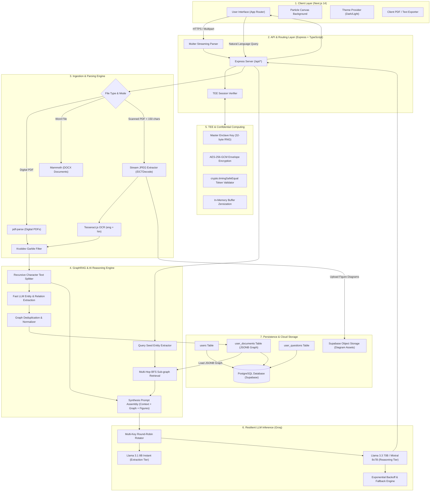
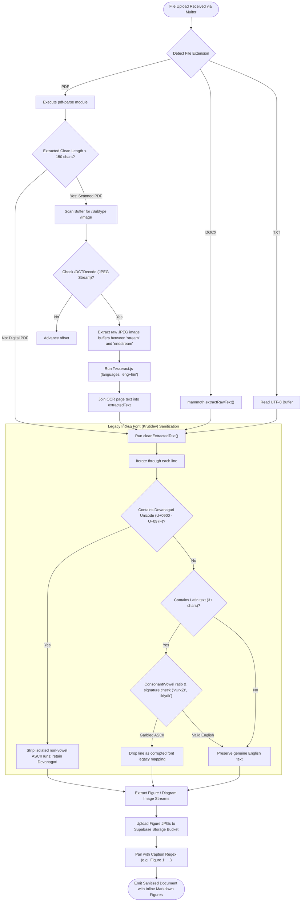
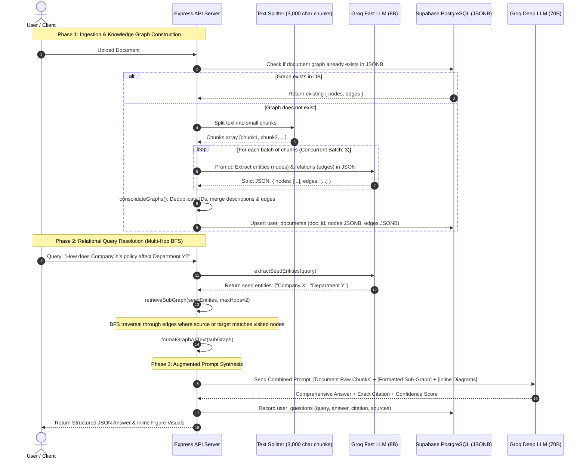
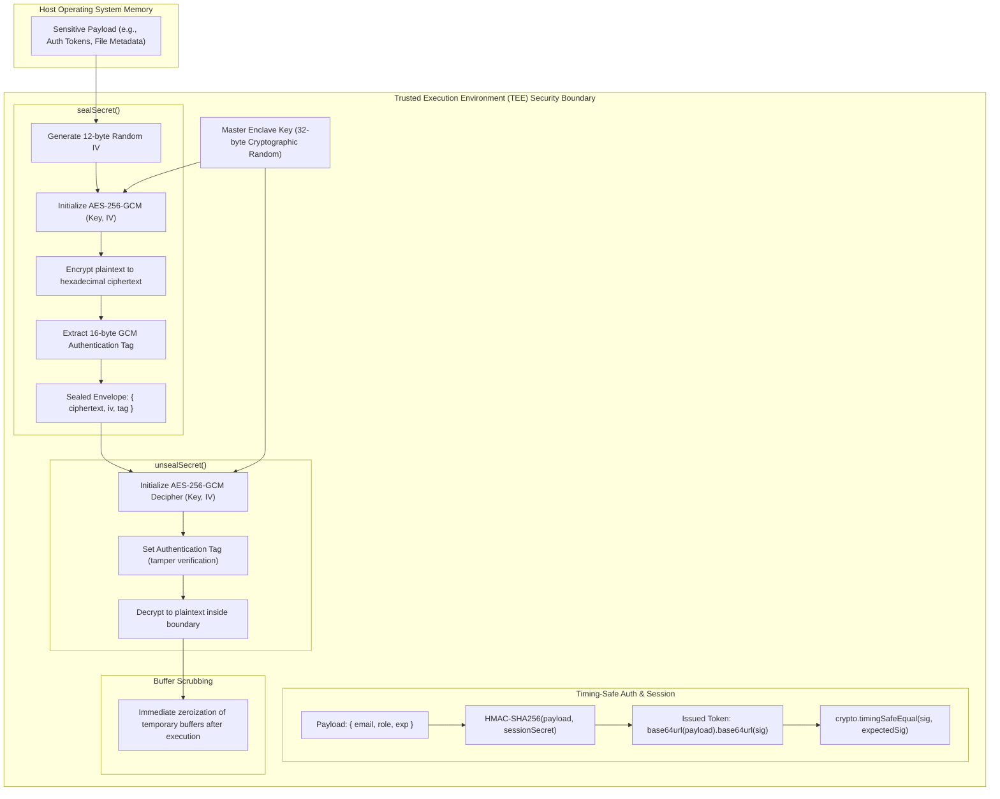
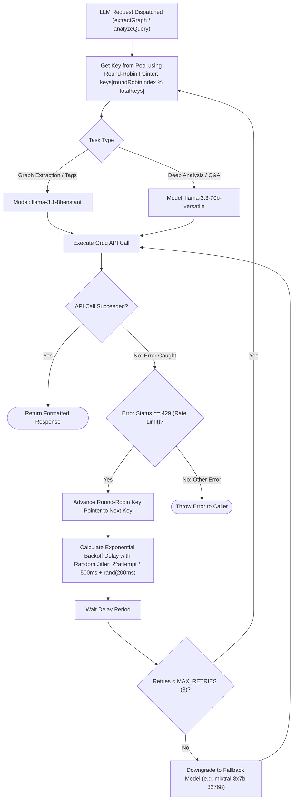
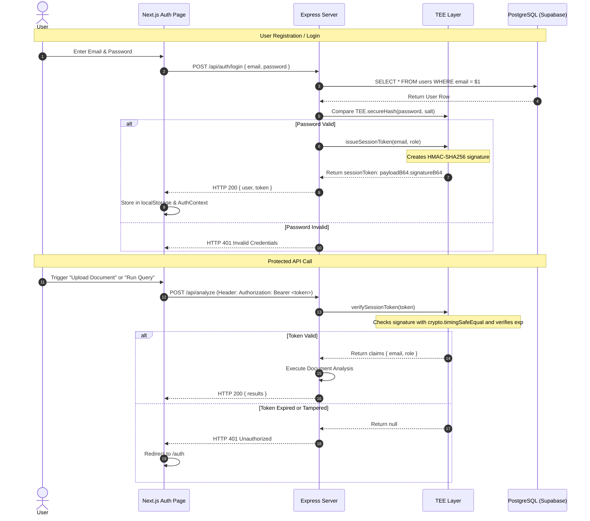

# 01 — Architecture & System Flowcharts

This document details the complete architectural blueprints and lifecycle flowcharts of **DocuMind AI** using **Mermaid diagrams** and visual process models.

---

## 1. High-Level End-to-End System Architecture

---

## 2. Document Ingestion & Dual OCR Pipeline Flowchart

This flowchart illustrates how DocuMind determines whether a document is digital or scanned, extracts raw text and figures, cleans legacy Hindi font artifacts, and readies content for indexing.

---

## 3. GraphRAG Pipeline: Extraction, Consolidation, Traversal & Synthesis

---

## 4. Confidential Computing / TEE Simulation Flowchart

---

## 5. Multi-Key LLM Routing & Exponential Backoff Flowchart

---

## 6. Authentication & Session Lifecycle Flowchart

