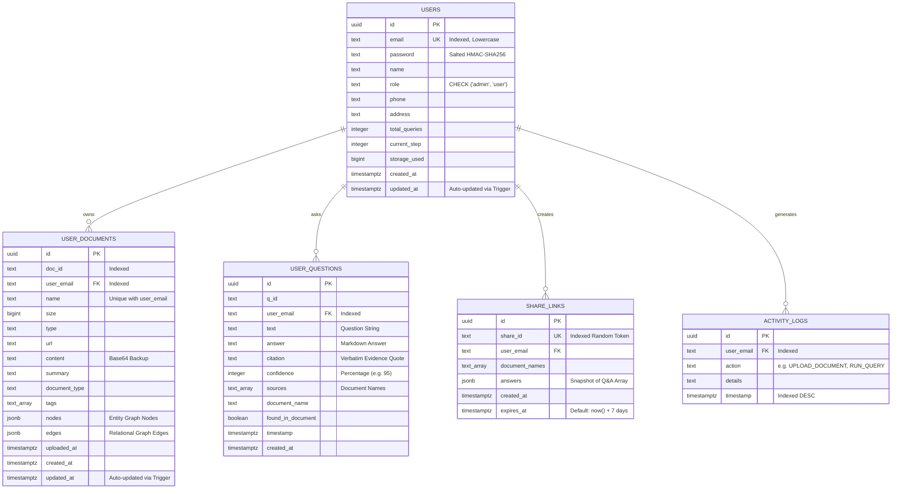

# 04 — Database Schema & Data Models

This document details the relational data architecture of **DocuMind AI**, implemented in **PostgreSQL (Supabase)**. It covers entity relationships, column definitions, constraints, indexes, triggers, and JSONB knowledge graph representations.

---

## 1. Entity-Relationship (ER) Diagram



---

## 2. Table Specifications & DDL Breakdown

### 2.1 Table: `users`
Stores user profile, authentication state, and platform utilization quotas.

```sql
create table if not exists users (
  id uuid primary key default gen_random_uuid(),
  email text not null unique,
  password text not null,
  name text not null,
  role text not null default 'user' check (role in ('admin', 'user')),
  phone text not null default '',
  address text not null default '',
  total_queries integer not null default 0,
  current_step integer not null default 1,
  storage_used bigint not null default 0,
  created_at timestamptz not null default now(),
  updated_at timestamptz not null default now()
);

create index if not exists idx_users_email on users (email);
```

- **Primary Key**: `id` (UUID generated via `gen_random_uuid()`).
- **Unique Constraint**: `email` (normalized lowercase string).
- **Check Constraint**: `role in ('admin', 'user')`.
- **Index**: `idx_users_email` ensures $O(\log n)$ user lookups during authentication.

---

### 2.2 Table: `user_documents`
Stores document metadata, base64 content backups, and the extracted Knowledge Graph topologies.

```sql
create table if not exists user_documents (
  id uuid primary key default gen_random_uuid(),
  doc_id text not null,
  user_email text not null,
  name text not null,
  size bigint not null default 0,
  type text not null default '',
  url text not null default '',
  content text not null default '',
  summary text not null default '',
  document_type text not null default 'General',
  tags text[] not null default '{}',
  uploaded_at timestamptz not null default now(),
  nodes jsonb not null default '[]',
  edges jsonb not null default '[]',
  created_at timestamptz not null default now(),
  updated_at timestamptz not null default now(),
  unique (user_email, name)
);

create index if not exists idx_user_documents_email on user_documents (user_email);
create index if not exists idx_user_documents_doc_id on user_documents (doc_id);
```

- **Composite Unique Constraint**: `(user_email, name)` prevents duplicate document naming under the same account while enabling idempotent upserts.
- **`nodes` and `edges` (JSONB)**: Holds the serialized knowledge graph. PostgreSQL `JSONB` stores data in a parsed binary format with indexed keys, allowing rapid retrieval without external relational joins.

---

### 2.3 Table: `user_questions`
Maintains historical records of questions submitted, answers generated, citations, and confidence scores.

```sql
create table if not exists user_questions (
  id uuid primary key default gen_random_uuid(),
  q_id text not null,
  user_email text not null,
  text text not null,
  answer text not null default '',
  citation text not null default '',
  confidence integer not null default 95,
  sources text[] not null default '{}',
  document_name text not null default '',
  found_in_document boolean not null default true,
  "timestamp" timestamptz not null default now(),
  created_at timestamptz not null default now()
);

create index if not exists idx_user_questions_email on user_questions (user_email);
```

- **`sources` (`text[]`)**: Array of document names that contributed context to the answer.
- **`citation`**: Verbatim sentence quoted from the source text verifying the answer.

---

### 2.4 Table: `share_links`
Manages publicly accessible, time-limited report sharing links.

```sql
create table if not exists share_links (
  id uuid primary key default gen_random_uuid(),
  share_id text not null unique,
  user_email text not null,
  document_names text[] not null default '{}',
  answers jsonb not null default '[]',
  created_at timestamptz not null default now(),
  expires_at timestamptz not null default (now() + interval '7 days')
);

create index if not exists idx_share_links_share_id on share_links (share_id);
```

- **`expires_at`**: Automatic 7-day expiration period calculated at link generation time.
- **`answers` (`JSONB`)**: Complete immutable snapshot of the results array at the time of sharing.

---

### 2.5 Table: `activity_logs`
System-wide audit trail recording user actions for administrative oversight and security auditing.

```sql
create table if not exists activity_logs (
  id uuid primary key default gen_random_uuid(),
  user_email text not null,
  action text not null,
  details text not null default '',
  "timestamp" timestamptz not null default now()
);

create index if not exists idx_activity_logs_email on activity_logs (user_email);
create index if not exists idx_activity_logs_timestamp on activity_logs ("timestamp" desc);
```

- **Index on Timestamp (`desc`)**: Optimizes queries for recent administrative activity logs.

---

## 3. Database Triggers & Automation

### Automated `updated_at` Trigger
To ensure data integrity without relying on application-level clock synchronization, PostgreSQL triggers update the `updated_at` column whenever a row is modified:

```sql
create or replace function set_updated_at()
returns trigger as $$
begin
  new.updated_at = now();
  return new;
end;
$$ language plpgsql;

create trigger trg_users_updated_at 
  before update on users
  for each row execute function set_updated_at();

create trigger trg_user_documents_updated_at 
  before update on user_documents
  for each row execute function set_updated_at();
```

---

## 4. JSONB Knowledge Graph Payloads

### Sample `nodes` JSONB Column Value
```json
[
  {
    "id": "dr_arun_sharma",
    "label": "Dr. Arun Sharma",
    "type": "Person",
    "description": "Chief Scientific Officer and lead author of the 2024 Clinical Evaluation Report."
  },
  {
    "id": "novavaccine_phase_3",
    "label": "NovaVaccine Phase-3",
    "type": "ClinicalTrial",
    "description": "Multi-center clinical trial covering 15,000 subjects testing efficacy against RSV."
  },
  {
    "id": "fda_compliance_guideline",
    "label": "FDA Biologics Guideline 21-CFR",
    "type": "RegulatoryStandard",
    "description": "Federal standard mandating double-blind validation protocols for vaccine approvals."
  }
]
```

### Sample `edges` JSONB Column Value
```json
[
  {
    "source": "dr_arun_sharma",
    "target": "novavaccine_phase_3",
    "relation": "PRINCIPAL_INVESTIGATOR",
    "description": "Dr. Sharma oversees trial protocol adherence and adverse event reporting."
  },
  {
    "source": "novavaccine_phase_3",
    "target": "fda_compliance_guideline",
    "relation": "MANDATED_BY",
    "description": "Phase-3 trial methodology was engineered specifically to fulfill 21-CFR requirements."
  }
]
```
